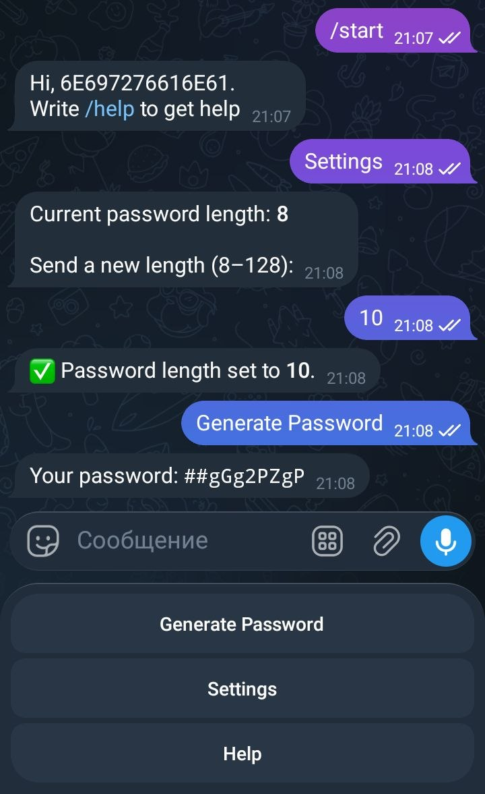

<h1 align="center">🔐 Password Bot</h1>

<p align="center">
  An open-source Telegram bot that generates secure passwords.
</p>

<p align="center">
  
</p>

<p align="center">
  
</p>

## 🤖 Commands

| Command     | Description                    |
|-------------|--------------------------------|
| `/start`    | Start the bot                  |
| `/help`     | Show instructions              |
| `/pass`     | Generate a password            |
| `/settings` | Change the password length     |

## 🛠 Tech stack

- Python 3.14
- [aiogram](https://docs.aiogram.dev/) 3.31.0
- python-dotenv
- SQLite (via aiosqlite)

## 📁 Project structure

```
.
├── Dockerfile
├── images
│   └── passbot-picture.jpg
├── LICENSE
├── pyproject.toml
├── README.md
├── requirements.txt
├── src
│   ├── database
│   │   └── db.py            # SQLite access
│   ├── handlers
│   │   ├── help.py          # /help
│   │   ├── passwd.py        # /pass
│   │   ├── setting.py       # /settings
│   │   └── start.py         # /start
│   ├── keyboards
│   │   └── main.py          # Bot keyboards
│   ├── main.py              # Entry point
│   └── states
│       └── pass_length.py   # FSM state for password length
└── uv.lock
```

## 🚀 Run on your machine

You can use either Podman or Docker.

### 1. Clone and configure

```bash
git clone git@github.com:EmilN2S/password-bot.git
cd password-bot
echo "BOT_TOKEN=HereIsYourToken" > .env
```

Replace `HereIsYourToken` with the token you got from [@BotFather](https://t.me/BotFather).

### 2. Build and run

**Podman**

```bash
podman build -t password-bot .
podman run -d --name password-bot --env-file .env password-bot
```

**Docker**

```bash
docker build -t password-bot .
docker run -d --name password-bot --env-file .env password-bot
```

### 3. Stop and start again

| Action | Podman                      | Docker                      |
|--------|-----------------------------|-----------------------------|
| Stop   | `podman stop password-bot`  | `docker stop password-bot`  |
| Start  | `podman start password-bot` | `docker start password-bot` |

## 📄 License

See the [LICENSE](LICENSE) file.
